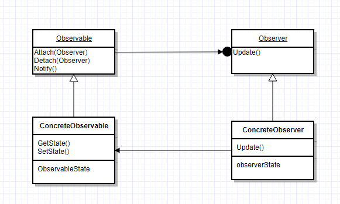

---
layout:		post
title:		Observer, Observable and LazyObject
subtitle:
date:		2017-11-24
author: 	Grant6899
header-img: img/post-bg-c++.jpg
catalog: true
tags:
    - c++
    - Desgin Pattern
    - Quantlib
---

# Observer and Observable

## Intent

Define a one-to-many dependency between objects so that when one object changes state, all its dependents are notified and updated automatically

## Applicability

Use the Observer pattern in any of the following situations:
- When an abstraction has two aspects, one dependent on the other. Encapsulating these aspects in separate objects lets you vary and reuse them independently.
- When a change to one object requires changing others, and you don't know how many objects need to be changed.
- When an object should be able to notify other objects without making assumptions about who these objects are. In other words, you don't want these objects tightly coupled

## Structure



## Participants

- Subject
  - knows its observers. Any number of Observer objects may observe a subject.
  - provides an interface for attaching and detaching Observer objects.
- Observer
  - defines an updating interface for objects that should be notified of changes in a subject.
- ConcreteSubject
  - stores state of interest to ConcreteObserver objects.
  - sends a notification to its observers when its state changes.
- ConcreteObserver
  - maintains a reference to a ConcreteSubject object.
  - stores state that should stay consistent with the subject's.
  - implements the Observer updating interface to keep its state consistent with the subject's.

## Implementation in Quantlib

```c++
class Observable {
	friend class Observer;
public:
	void notifyObservers() {
		for (iterator i=observers_.begin();
			i!=observers_.end(); ++i) {
			try {
				(*i)->update();
			} catch (std::exception& e) {
			// store information for later
			}
		}
	}

private:
	void registerObserver(Observer* o) {
		observers_.insert(o);
	}
    
	void unregisterObserver(Observer*);
	list<Observer*> observers_;
};

class Observer {
public:
	virtual ~Observer() {
		for (iterator i=observables_.begin();
			i!=observables_.end(); ++i)
		(*i)->unregisterObserver(this);
	}
	
    void registerWith(const shared_ptr<Observable>& o) {
		o->registerObserver(this);
		observables_.insert(o);
	}

	void unregisterWith(const shared_ptr<Observable>&);
	virtual void update() = 0;
    
private:
	list<shared_ptr<Observable> > observables_;
};
```
Each time when we change the state of an observable, inside the derived class's State-Changing function, we call notifyObservers() in inform all its observers to do corresponding updates.

We also have registration functions in Observer to add/remove themselves in/from the list in its observer, it's no issue because Observer is a friend class of Observable.

# LazyObject

## Intent

The motivation of LazyObject in quantlib is very natural. Consider we have a yield curve and observed 10 rate points on it. Each rate is an observable and will notify the yield curve whenver it's changed. You may not want to recalculate the yield curve everytime a single node is changed, becasue that would be 10 times. Instead, when want it to do that in a pretty lazy way, which is to run recalculation only when it's necessary.

## Implementation in Quantlib

```c++
class LazyObject : public virtual Observable,
                   public virtual Observer {
public:
	void update();
    void recalculate();
    void freeze();
    void unfreeze();
    void alwaysForwardNotifications();
protected:
        virtual void calculate() const;
        virtual void performCalculations() const = 0;
        mutable bool calculated_, frozen_, alwaysForward_;
};

// inline definitions

inline LazyObject::LazyObject()
: calculated_(false), frozen_(false), alwaysForward_(false) {}

inline void LazyObject::update() {
    if (calculated_ || alwaysForward_) {
        calculated_ = false;
        // observers don't expect notifications from frozen objects
        if (!frozen_)
            notifyObservers();
            // exiting notifyObservers() calculated_ could be already true because of non-lazy observers
    }
}
 
inline void LazyObject::recalculate() {
    bool wasFrozen = frozen_;
    calculated_ = frozen_ = false;
    try {
        calculate();
    } catch (...) {
        frozen_ = wasFrozen;
        notifyObservers();
        throw;
    }
    frozen_ = wasFrozen;
    notifyObservers();
}

inline void LazyObject::freeze() {
    frozen_ = true;
}

inline void LazyObject::unfreeze() {
    // send notifications, just in case we lost any,
    // but only once, i.e. if it was frozen
    if (frozen_) {
        frozen_ = false;
        notifyObservers();
    }
}

inline void LazyObject::alwaysForwardNotifications() {
    alwaysForward_ = true;
}

inline void LazyObject::calculate() const {
    if (!calculated_ && !frozen_) {
        calculated_ = true;   // prevent infinite recursion in case of bootstrapping
        try {
            performCalculations();
        } catch (...) {
            calculated_ = false;
            throw;
        }
    }
}
```

LazyObject's update() and calculate() is not allowed to be modified, we must implement performCalculations() for each class derived from LazyObject. LazyObject will not recalculate until it has to do, like NPV(), getVanillaPrice() are called.

