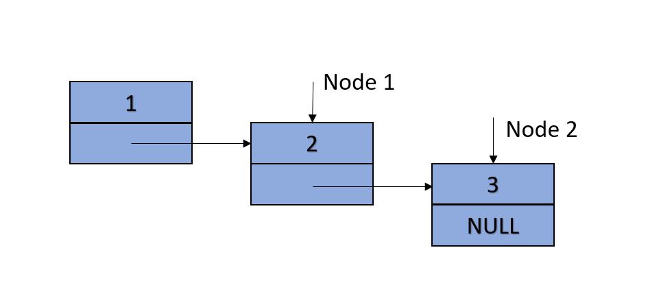
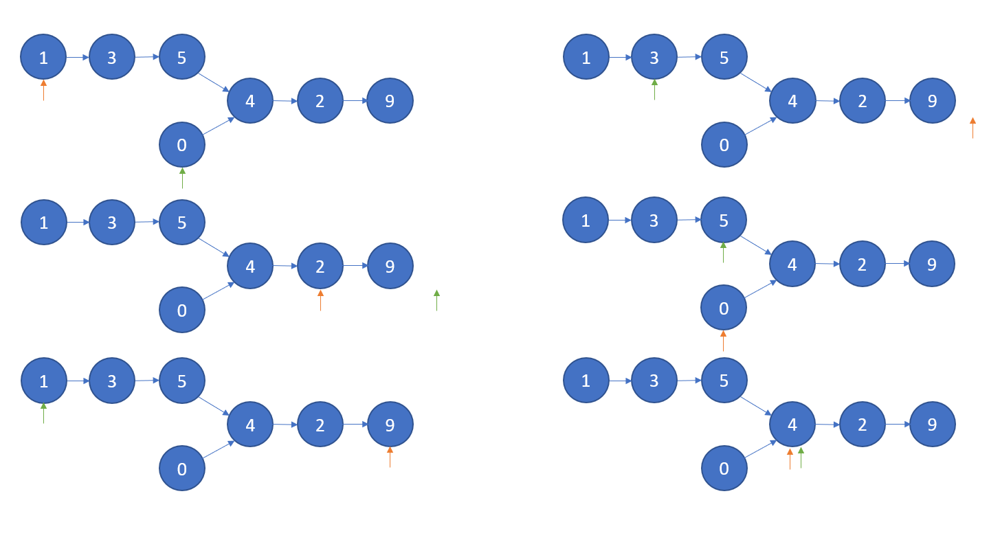

---
layout:		post
title:		Linked List Summary
subtitle:
date:		2017-12-07
author: 	Grant6899
header-img: img/post-bg-c++.jpg
catalog: true
tags:
    - c++
    - Algorithm
    - Data Structure
    - Interview
---


## Linked List Definition

Below is the assumption of ListNode definition on which we are based for this blog.
```c++
struct ListNode {
	int val;
	ListNode *next;
	ListNode(int x) : val(x), next(NULL) {}
};
```

## Basic Operations

### 1. Create Linked List from Vector
```c++
ListNode* createLinkedList(vector<int> vec) {
	ListNode* head = NULL, *prev = new ListNode(0);
	for (auto it = vec.begin(); it < vec.end(); ++it) {
		ListNode* newhead = new ListNode(*it);
		prev->next = newhead;
		prev = prev->next;
		if (it == vec.begin())
			head = prev;
	}
	return head;
}
```

### 2. Print Linked List
```c++
void printLinkedList(ListNode* head) {
	while (head != NULL) {
		cout << head->val << " ";
		head = head->next;
	}
	std::cout << std::endl;
}
```

### 3. Reverse List
```c++
ListNode* reverseList(ListNode* head) {
	ListNode* pre = NULL;
	while (head != NULL) {
		ListNode* temp = head->next;
		head->next = pre;
		pre = head;
		head = temp;
	}
	return pre;
}
```

### 4. Remove a Node from List
```c++
void deleteNode(ListNode* node) {
    *node = *(node->next);
}
```
Note node here is just a copy of address. To change the value pointer, we must have it dereferenced. 

This method doesn't work for tail case(Node 2):




## Tricks in Linked List

### Dummy Head
```c++
ListNode* dummyList(ListNode* head) {
	// create dummy head
    ListNode* pre = new ListNode(0);
    pre->next = head;
	
    while (head != NULL) {
		pre = head;
		head = head->next;
	}
    
	return pre->next;
}
```

### Fast and Slow Pointers
```c++
ListNode* FastSlowList(ListNode* head) {
	
    ListNode* p1 = head, p2 = head, pre = head;
    	
    while (p1 != NULL && p1->next != NULL) {
		pre = p2;
        p1 = p1->next->next;
        p2 = p2->next;
	}
    
	return pre;
}
```

Usages:
- Divide original list into two whose length are same ( |len1 - len2| <= 1)
- Check if there is circle in the list and find the entry node of the circle


### Check if two linked lists have intersection

Have two pointers start from begining of each list, then move them 1 node forward each time, if it's null then make current pointer to the other list's beginning. Stop the loop until they meet each other, if the node where they meet is not NULL then it's the entry point of intersection, otherwise there is no intersection.




### Recursively Merge Two Sorted Lists
```c++
ListNode* merge(ListNode* h1, ListNode* h2){
    if (h1 == NULL)
        return h2;
    if (h2 == NULL)
        return h1;
        
    if (h1->val < h2->val){
        h1->next = merge(h1->next, h2);
        return h1;
    }
    else{
        h2->next = merge(h1, h2->next);
        return h2;
    }
}
```

### Use double pointer (**ptr) smartly

Sometimes we need to change the pointer itself, an example to remove values equal to target from a list:
```c++
ListNode *removeElements(ListNode* head, int val) {
    ListNode **hptr = &head;

	while(*hptr != NULL){
        if ((*hptr)->val == val){
                // change the pointer itself saved in ListNode, make the pointer pointed by hptr point to next Node's next Node
                *hptr = (*hptr)->next;
        }
        else{
            // make hptr point to next pointer saved in ListNode
            hptr = &(*hptr)->next;
        }
           
    }
    return head;
}
```


